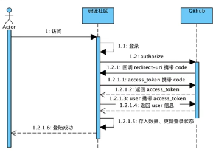
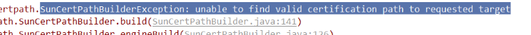
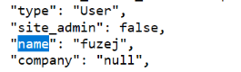
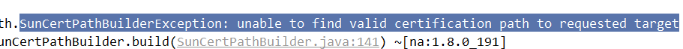

# 2.2

    1.
    2.快捷键:
        1.ctrl + P
    3.git 命令
        git init
        git status 没选择的 .ignoregit 
        git add .
        git st
        git commitgi
        配一个当前的用户名
            vim .git/config
        
## 问题

# 2.4

    1.ctrl + alt + v 
    2.
## 知识点
1.

## 问题
1.

    浏览器证书问题
    AuthorizeController2.

2.OKHttp 是什么

# 2.7

    1.application.properties 在里边设置一些常量 @Value 注入 ，方便测试修改
    2. day to day
## 问题
1.

    github 设置namein
2.

    github证书问题 or Chrome 的没有登录过？？？ 或其设置问题
    彻底解决unable to find valid certification path to ...
        https://blog.csdn.net/gabriel576282253/article/details/81531746