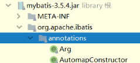

# 2.2

    1.
    2.快捷键:
        1.ctrl + P
    3.git 命令
        git init
        git status 没选择的 .ignoregit 
        git add .
        git st
        git commitgi
        配一个当前的用户名
            vim .git/config
        
## 问题

# 2.4

    1.ctrl + alt + v 
    2.
## 知识点
1.

## 问题
1.

    浏览器证书问题
    AuthorizeController2.
2.OKHttp 是什么

# 2.7

    1.application.properties 在里边设置一些常量 @Value 注入 ，方便测试修改
    2. day to day 的学习方法
    3. 数据库H2:
        create table user
        (
        	id int,
        	account_id varchar(100),
        	name varchar(50),
        	token char,
        	gmt_create bigint,
        	gmt_modified bigint
        );

        默认存储路径C:/Users/Administrator
        url=jdbc:h2:E:/StudySpringBoot/community/community
        右边的database 不能和启动项目同时打开
        
        user表：
            BIGINt 是什么时间戳
            CHAR 其实就是java的long
            修改时间：方便差错
    4.shift + F6
        修改某个变量值
    5.SpringBoot数据库导入问题
        application.properties 配置后就能连接？
        后缀名和 功能模块的 联系 （xml 、mapper 和 数据库）
        
        myMybatis-spring 和 mybatis 的区别
        
## 问题
1.

    github 设置namein
2.

    github证书问题 or Chrome 的没有登录过？？？ 或其设置问题
    彻底解决unable to find valid certification path to ...
        https://blog.csdn.net/gabriel576282253/article/details/81531746
3.

    点击登录——》 存放 Session ——》th：if 有 ——》 显示”我“ 
    问题：每次都需要登录——》 持久化 ——》数据库
4.学习Mybatis 源码

5.

    没有mapperscan注解 ——》一定是依赖问题——》
        依赖导入错 ——》spring-Mybatis 
    ——》还是错误，——》
    

    @Repositry是 SpringBoot的 吗？？？
    Mapper 一定是interface！！！

6.

    驼峰命名法和 下换线

    